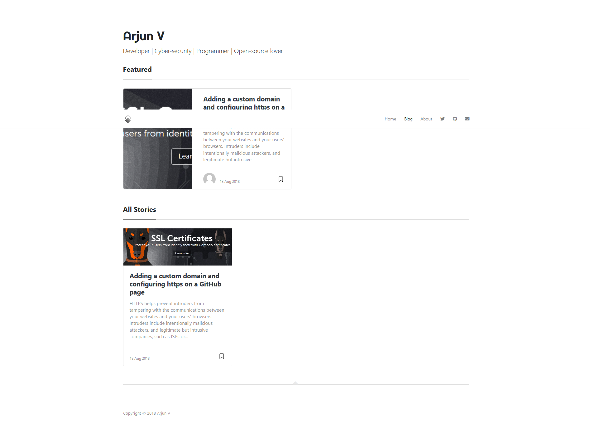

# Minimalist Jekyll Theme

#### Minimalist jekyll theme is a minimal github theme made using Jekyll for developping static websites.

---
[Live](https://arjunvijayanathakurup.me/blog/)  |  [Download](https://github.com/imarjunv/minimalist-jekyll-theme/archive/master.zip)

---
This theme is a modified version of mediumishh theme with a minimalist touch.
The theme is a well built, simple yet a great looking theme developed under the inspiration of medium. If you are a medium blogger then you would really love this theme.

## How to use minimalist
* Open <code>_config.yml</code>. If your site is in root, for <code>baseurl</code>, make sure this is set to <code>baseurl: /</code>.
* Edit the necessary changes in the theme and add new posts in <code>_post</code> using <code>2018-01-11-cutome-code.md</code> file name where the date should be format should be exact but content can be changed.

Feel free to contribute to the theme by clonning the repository and pull a request.
## Contribute
* Clone the repo.
* Create a branch off of master and give it a meaningful name (e.g. my-new-minimalist-feature).
* Open a pull request on GitHub and describe the feature or fix.
